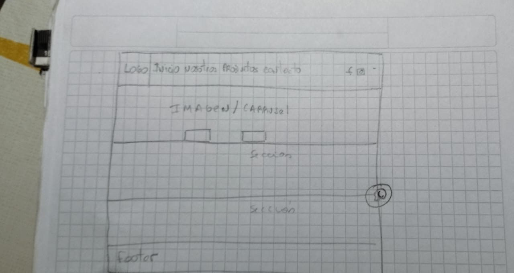

# Proyecto Tienda para Mascotas (*frontend*)
Sitio desarrollado para la primera parte del curso «Python Fullstack» del programa **Codo a Codo**.

## Acerca del proyecto
Desarrollo de una plataforma para la oferta de productos para mascotas , promoción de productos.

## Maquetación básica

## Contenido
- Implementación de estructura de las páginas del sitio con lenguaje HTML y etiquetas semánticas.
- Implementación de estilos con lenguaje CSS.
- Implementación de interacción con el sitio a través de JavaScript:validación de formularios.

## Desarrollo del proyecto
Se inicia aplicando maquetación básica con HTML y CSS.
Luego se incorpora JavaScript para obtener interacción con el sitio e implementar contenido dinámico.
Luego se agregan las restantes paginas que conforman el sitio.

## Objetivo
Obtener un sitio acorde a los lineamientos del «Trabajo Práctico Obligatorio» correspondiente a la parte de *frontend* del curso.
